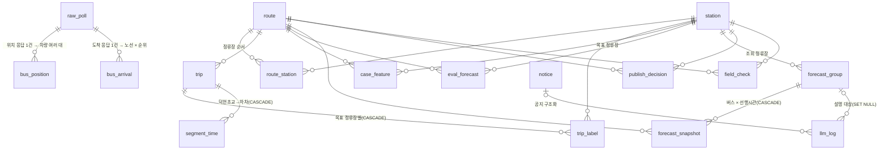

# DB 스키마 초안 v2 (10/7 회의용)

**수집(raw_poll 메타 → bus_position·bus_arrival) → 운행편(trip) → 정답(trip_label)·구간 소요(segment_time) → 사례 특징(case_feature) → 평가 예보(eval_forecast)·공개 판정(publish_decision), 그리고 화면 요청마다 예보 묶음(forecast_group) → 예보 행(forecast_snapshot)으로 흐르는 18개 테이블이다. 기준 파일은 `backend/migrations/0001_init.sql`이고, 되돌리기는 `down/0001_down.sql`이다.**

> 아직 어느 DB에도 적용하지 않은 초안이다. 그래서 v2 변경도 0002를 만들지 않고 0001을 고쳤다. 열 이름은 API 계약 v2(`docs/api-contract.md`) 필드와 같은 뜻의 snake_case로 맞췄다(아래 'API 필드 대응').

## 테이블

하루 행 수는 평일 수집 창(05:30~10:15) 기준이다. 표시가 없으면 추정이다.

| 테이블 | 무엇을 담나 | 누가 채우나 | 하루 행 수 |
|---|---|---|---|
| route | 노선(이름, 유형, 관할, 수집 여부, 라벨 대상, 예약·심야) | 사람(discover 결과 + settings) | 고정 18행 |
| station | 정류장(이름, 번호, 좌표) | 사람(discover) | 고정, 수백 행 |
| route_station | 노선별 정류장 순번, 회차 지점 | 사람(discover) | 고정, 수백~1천 행 |
| **service_day** (새로) | 날짜별 평일·공휴일 여부, 수집 운영 구분(`regular`·`trial`·`none`), 특이사항(200자) | 사람 또는 스크립트 | 1 |
| raw_poll (변경) | GBIS 호출 메타데이터. **본문 없음.** JSONL 파일·줄 번호, 호출 시각, 대상, 성공 여부, 코드 | 수집기(또는 JSONL 적재 스크립트) | **2,850** (G1300 1,710 + 1306 570 + 도착 570) |
| bus_position (변경) | 위치 응답의 차량 1대 1회 관측. 키 (raw_poll_id, item_index) | 수집기·적재 스크립트 | 약 35,340 (G1300 1,710 × 19대 + 1306 570 × 5대) |
| **bus_arrival** (새로, 메인 제안) | 도착 응답의 노선 항목 × 순위(1·2번째 차): 도착 예상(초·분), 후보 잔여석, 차량 | 수집기·적재 스크립트 | 최대 2,280 (570 × 2노선 × 2순위) |
| trip | 운행편(안정 키 `trip_key`) | 라벨(F06) | 약 50~100 |
| trip_label (변경) | 운행편 × 목표 정류장의 0석 정답, 등급, 미확인 사유, **정답 확정 시각 `confirmed_at`** | 라벨(F06) | trip 수 × 규칙 버전 수 |
| segment_time (변경) | 구간 소요시간. **덕현초교 → 그 노선의 하차 정류장 한 쌍만** | 라벨 뒤 단계 | trip 수(노선당 1구간) |
| **case_feature** (새로) | 운행편 × 목표 정류장 × 선행시간의 기준 시각, 그 시점 잔여석·앞차 간격, 계산 가능 여부 | 예보·평가 배치 | trip 수 × 3 |
| **eval_forecast** (새로) | 평가용 예보(모든 운행 × 선행시간): 상태, n·k, 확률, 사례 목록, 정답 | 평가 배치 | trip 수 × 3 × 규칙 버전 수 |
| **forecast_group** (새로) | 예보 묶음 = 한 화면 요청. id = API `snapshotId`. 조회 조건, 서비스 상태, 대안 결과 | 예보 API(F07) | 조회 수만큼 |
| forecast_snapshot (변경) | 묶음의 자식 행: 버스 × 선행시간(3개 모두). 상태 7종, `issued_at`, 확률, n·k, 예비 표시, 화면 선택 표시 | 예보 API(F07) | 조회 1회에 최대 18행(노선 2 × 후보 3 × 선행시간 3) |
| **publish_decision** (새로) | 공개 판정 이력(노선 × 정류장 × 선행시간): 상태, 지표 6종, 표본 수, 평가 기간 | 평가 후 사람 | 판정할 때 몇 행 |
| notice | 공지 링크, 구조화 결과, 승인 상태 | LLM + 사람(승인) | 0~몇 건 |
| llm_log (변경) | LLM 검사 결과·지연·고정 문구 대체 여부(질문은 HMAC만). **묶음 참조는 forecast_group FK** | LLM(F08) | 300 이하(하루 상한) |
| field_check (변경) | 현장 대조 관측. **운행편은 trip_key로 가리킨다** | 사람 | 조사일에 수십 건 |

### 바뀐 열 요약

| 테이블 | 새로 | 변경 | 삭제 |
|---|---|---|---|
| raw_poll | `jsonl_file`, `line_no`, `route_id`·`station_id`(일반 열, 숫자 형식 CHECK), `raw_poll_target_chk` | 키 `(source_date, source_line)` → `(jsonl_file, line_no)`, `result_code` 형식 CHECK | `body`, `body_text`, `params`, `source_date`, `source_line`, `elapsed_ms`, `result_message`, `error`, `is_weekday` |
| bus_position | | `raw_poll_id` NOT NULL·ON DELETE RESTRICT, 기본키 `(raw_poll_id, item_index)` | `bus_position_id`, 인덱스 `(route_id, veh_id, collected_at)` |
| trip_label | `confirmed_at_chk` | `arrival_at` → `confirmed_at`(같은 값, 이름과 뜻을 분명히) | |
| segment_time | `segment_time_scope_chk` | `from_station_id`·`to_station_id` NOT NULL | |
| forecast_snapshot | `forecast_group_id`(FK), `source`, `station_arrival_at`, `arrival_estimate_source`, `in_forecast_hours`, `current_seats`, `seats_updated_at`, `issued_at`, `no_seat_probability`, `n`, `k`, `preliminary`, `input_seats`, `input_headway_min`, `is_selected` | `lead_time_min` NOT NULL, `status` 7종 | `snapshot_group_id`, `computed_at`, `station_id`, `destination_id`, `deadline_at`, `candidate_kind`, `predict_time_sec`, `input_collected_at`, `remain_seat_cnt`, `headway_min`, `case_count`, `zero_seat_count`, `probability`, `label_rule_version`, `alternative_result`, `alternative_status`, `is_preliminary`, `rule_version` (조회 조건·대안·버전은 forecast_group으로) |
| llm_log | `forecast_group_id`(FK, ON DELETE SET NULL) | | `snapshot_group_id` |
| field_check | `trip_key`(형식 CHECK) | | `trip_id` |

## 수집 설정

수집 창: 평일 05:30 이상 10:15 미만(17,100초). 대상별 주기는 `backend/app/core/settings.py`가 기준이다.

| 대상 | 개수 | 주기 | 하루 호출(대상당) | 하루 호출(합) | DB 적재 |
|---|---|---|---|---|---|
| 위치 G1300 | 1 | 10초 | 1,710 | 1,710 | raw_poll + bus_position |
| 위치 1306 | 1 | 30초 | 570 | 570 | raw_poll + bus_position |
| 위치 나머지 (1100, 1101, 1304, 1407, 8300, 8906, G1200, P9601·P9602·P9603 출근) | 10 | 40초 | 428 | 4,280 | JSONL만 |
| **위치 합계** | **12** | | | **6,560** (≤ 9,000) | |
| 도착 덕현초교(잠실행 235000392) | 1 | 30초 | 570 | 570 | raw_poll + bus_arrival |

- 40초 대상의 428은 KST 자정 기준 40초 경계 중 창 안에 드는 수다(05:30은 경계에 포함, 10:15는 제외).
- 수집기는 공휴일에도 수집하고 `is_holiday`로 표시한다. 예보는 설정 공휴일(초기값 2026-10-09)에 하지 않는다.

## 용량 재추정

PostgreSQL 행 머리(24B)·정렬·줄 포인터를 넣고, 인덱스는 채움률 90%로 잡았다. 차량 수(G1300 19대, 1306 5대)는 시운전 중 많은 시점 값이라 위쪽 추정이다.

| 테이블 | 하루 행 | 행당(힙 + 인덱스) | 하루 용량 |
|---|---|---|---|
| raw_poll | 2,850 | 약 140B + 150B | 약 0.8MB |
| bus_position | 35,340 (32,490 + 2,850) | 약 125B + 75B | 약 7MB |
| bus_arrival | 최대 2,280 | 약 130B + 100B | 약 0.5MB |
| trip·trip_label·segment_time·case_feature | 수백 | | 0.1MB 이하 |
| eval_forecast | trip 수 × 3(약 300) | 약 1.2KB (사례 목록 30건 포함) | 약 0.4MB (규칙 버전마다 전체 기간을 다시 쌓는다) |
| **수집·라벨·평가 합계** | | | **약 9MB** |
| forecast_group + forecast_snapshot | 조회 1회당 1 + 최대 18행 | 조회 1회당 약 15~20KB (사례 목록이 대부분) | 하루 300회면 약 6MB |

- v1 추정(하루 15~30MB)은 raw_poll 본문(10~20MB)이 대부분이었다. 본문을 빼서 수집 쪽은 하루 약 8MB로 줄었다.
- Supabase 무료 플랜(DB 500MB)에서 시스템 몫을 빼고 약 450MB를 쓸 수 있다고 보면, 수집·평가만이면 약 50평일(10주), 조회 하루 300회를 더하면 약 30평일(6주)이다.
- 가장 큰 변수는 bus_position(차량 수)과 예보 조회 수다. 평가를 규칙 버전마다 다시 돌리면 eval_forecast가 누적된다(8주 × 규칙 버전 1개 ≈ 12,000행, 약 15MB).
- 추정치이므로 첫 적재 뒤 `select pg_size_pretty(pg_total_relation_size('public.bus_position'));`로 실측한다.

## 관계



FK 없이 값으로 잇는 관계(점선 대신 글로 적는다):
- `trip_key`: case_feature, eval_forecast, field_check, forecast_snapshot·eval_forecast의 `case_trip_keys` → trip.trip_key. trip을 다시 만들어도 같은 운행편이면 같은 값이다. 운행 중인 차는 아직 trip 행이 없을 수 있다.
- 날짜: trip·case_feature·eval_forecast의 `service_date` → service_day.service_date(평일·정식 수집일 고르기).
- 정답 행: (trip_key → trip, station_id, label_rule_version) → trip_label.

## 설계 메모

### raw_poll 본문 제거와 재적재
- raw_poll은 호출 1건의 메타데이터만 둔다. 본문은 JSONL(`data/collected/<날짜>/raw_poll.jsonl`)이 기준이다. `jsonl_file`은 수집 폴더 기준 상대 경로(예: `2026-10-07/raw_poll.jsonl`)이고, `line_no`는 물리적 줄 번호(1부터, 빈 줄·깨진 줄 포함)다.
- **재적재는 같은 JSONL을 여러 번 넣어도 결과가 같다.**
  1. raw_poll: `INSERT … ON CONFLICT (jsonl_file, line_no) DO NOTHING RETURNING raw_poll_id`. 행이 안 돌아오면 같은 키로 SELECT 해 id를 얻는다.
  2. bus_position: `INSERT … ON CONFLICT (raw_poll_id, item_index) DO NOTHING`.
  3. bus_arrival: `INSERT … ON CONFLICT (raw_poll_id, item_index, arrival_rank) DO NOTHING`.
- **서비스 키 보호**: v1의 `params` serviceKey CHECK는 `params` 열과 함께 없어졌다. 대신 raw_poll에 자유 문자열 열(본문·파라미터·오류 메시지)을 두지 않고, `route_id`·`station_id`는 숫자만, `result_code`는 영문·숫자·`_-` 64자 이하만 받는다. 키가 들어갈 자리가 없다.
- `jsonl_file`은 정규식으로 `날짜/이름.jsonl` 형식만 받는다(`..`·절대 경로 불가).

### 보관 정책과 FK
- bus_position·bus_arrival의 `raw_poll_id`는 NOT NULL이고 `ON DELETE RESTRICT`다. raw_poll이 작아져서(행당 약 0.3KB) 따로 지울 이유가 줄었으므로 **세 테이블을 같은 기간 보관하고 함께 지운다**(자식 먼저, 그다음 raw_poll). 실수로 raw_poll만 지우면 오류가 나서 위치 기록을 잃지 않는다.
- bus_position의 대리키(`bus_position_id`)를 빼고 `(raw_poll_id, item_index)`를 기본키로 했다. 참조하는 곳이 없고, 행당 약 30B(하루 약 1MB)를 줄인다. `(route_id, veh_id, collected_at)` 인덱스도 뺐다(운행편 재구성은 노선·시각 범위로 읽고, 실시간은 최신 raw_poll_id로 읽는다).

### 평가용 예보: 두 안 비교와 선택
| | 안 A: forecast_snapshot에 섞기(`kind` 열) | 안 B: 별도 테이블 eval_forecast (선택) |
|---|---|---|
| 단위 | 화면 요청 묶음과 운행 × 선행시간이 한 테이블에 | 평가는 운행 × 정류장 × 선행시간 1행, 화면은 묶음 × 버스 × 선행시간 |
| 생명주기 | 보관 정리 때 구분 조건 필요 | 화면 스냅샷은 보관 기간으로 지우고, 평가는 규칙 버전별로 다시 계산 |
| 위험 | 조회마다 `kind` 조건이 필요하고 빠뜨리면 평가 지표가 오염된다 | 테이블이 하나 늘어난다 |
| 제약 | 묶음 FK·조회 조건을 NULL 허용으로 풀어야 함 | 각 테이블에 맞는 NOT NULL·UNIQUE를 둘 수 있다 |

선택 이유: 평가는 모든 운행 × 선행시간마다 계산하므로 화면 요청 단위인 스냅샷과 단위·생명주기가 다르다. 섞으면 매 조회에 구분 조건이 필요하고 평가 지표가 오염될 위험이 있다.

### 사례 특징(case_feature)
- 기준 시각 `reference_at` = 그 운행이 목표 정류장 도착 L분 전이 된 시각. `reference_basis`가 `actual_arrival`(과거 기록의 실제 도착 = `trip_label.confirmed_at` − L분)인지 `predicted_arrival`(실시간 도착 예상 기준)인지 남긴다.
- 계산할 수 없으면 `computable = false`와 사유(`uncomputable_reason`, 초안 코드 5개)를 남긴다. 사례 검색에서는 빠지고 그 예보는 `missing_input`이다.
- UNIQUE(trip_key, station_id, lead_time_min, rule_version). 같은 rule_version에서 실시간 행을 실제 도착 기준으로 다시 계산하면 같은 키라 덮어쓰게 된다(회의 안건 1).
- `rule_version`은 API `rulesVersion`과 따로 둔다. 선행시간 선택 규칙만 바뀌었을 때 특징을 다시 계산하지 않으려는 것이다.

### 정답 확정 시각
- `trip_label.confirmed_at` = 목표 정류장 도착 기록 시각(목표 순번 이상인 첫 위치 기록). 이 기록을 보는 순간 도착 전 마지막 잔여석이 정해지므로 정답이 확정된다. v1의 `arrival_at`과 같은 값이며 이름만 바꿨다.
- 사례 검색의 "예보 시점 전에 정답이 확정된 운행만"은 `confirmed_at < issued_at`으로 판정한다. strict·relaxed 행은 `confirmed_at`이 반드시 있다(CHECK).

### 예보 묶음과 행
- 한 화면 요청 = forecast_group 1행, id(uuid) = API `snapshotId`. 조회 조건, `service_state`, `next_refresh_at`, `next_forecast_start_at`, `rules_version`, `stale`, `data_updated_at`, 대안 결과(`alternative_status`, 추천 정보, `switch_suggested`, `candidates` jsonb)를 둔다. 대안은 별도 테이블로 나누지 않았다.
- forecast_snapshot은 버스 × 선행시간 1행이고 **선행시간 3개를 모두 저장**한다. 화면용 선행시간은 `is_selected`로 표시한다(버스마다 최대 1행, 부분 UNIQUE 인덱스). API `selectedLeadTimeMin` = `is_selected`인 행의 `lead_time_min`(없으면 null). 버스 단위 값(`source`, `station_arrival_at` 등)은 같은 버스의 3행에 같은 값을 넣는다.
- `arrival_estimate_source`(`predict_time_sec`·`predict_time_min`·`timetable`)를 저장해 분 단위 대체(임시 승인)를 평가에서 따로 집계할 수 있다.
- CHECK: `ok` ⇔ 확률 있음, `ok`면 `issued_at` 있음, `not_yet`이면 `issued_at` 없음, k ≤ n, 사례 목록 개수 = n.

### 공개 판정과 API 연결
- publish_decision은 이력이다(갱신하지 않고 새 행). API는 그 버스의 **노선·정류장·선행시간**과 **현재 rules_version**이 같은 최신 판정 1건(decided_at이 가장 늦은 행)을 본다.

| 최신 판정 | API status | preliminary |
|---|---|---|
| 행 없음 또는 `pending` | `ok`(사례 20건 이상일 때) | true |
| `passed` | `ok` | false |
| `failed` | `not_validated` (확률 없음) | true |

- 판정은 노선별이라 같은 화면에서 G1300은 passed, 1306은 pending처럼 갈릴 수 있다(회의 안건 3).
- `passed`는 지표 6종이 모두 있어야 하고, `pending`이 아니면 표본 수와 평가 기간이 있어야 한다(CHECK).

### 공휴일
- `service_day.is_holiday`와 설정 모듈의 공휴일 목록(초기값 2026-10-09)은 같은 정보다. 기준은 설정 모듈이고, 목록을 바꾸면 이 열도 함께 고친다. 공휴일에는 예보하지 않는다(`service_state = outside_collection`). 수집기는 공휴일에도 수집하고 `raw_poll.is_holiday`로 표시한다.

### segment_time 범위
- 덕현초교(잠실행 235000392) → 그 노선의 하차 정류장 한 쌍만 둔다. G1300(235000092)은 123000611 잠실광역환승센터, 1306(235000123)은 123000002 잠실역.잠실대교남단(중). `segment_time_scope_chk`가 이 조합만 받는다. 범위를 넓히면 이 CHECK를 고친다.

### bus_arrival (메인 제안, 회의에서 결정)
- raw_poll에서 본문을 빼면 도착 API 응답(도착 예상·후보 잔여석)이 DB에 남지 않는다. 그러면 API 서버가 수집 서버와 다른 곳에 있을 때 실시간 스냅샷과 도착 예상 평가의 근거가 없다. 그래서 도착 응답의 노선 항목을 순위(1·2)별로 한 행씩 둔다(G1300·1306만). 그 순위의 차량 정보가 없으면 행을 만들지 않는다.
- 순위 열 이름은 `rank` 대신 `arrival_rank`로 했다(SQL 표준 예약어와 겹치지 않게).

### API 필드 대응
| API(v2) | 테이블.열 |
|---|---|
| `snapshotId` | forecast_group.forecast_group_id |
| `computedAt`, `nextRefreshAt`, `rulesVersion`, `dataUpdatedAt`, `stale` | forecast_group.computed_at, next_refresh_at, rules_version, data_updated_at, stale |
| `service.state`, `service.nextForecastStartAt` | forecast_group.service_state, next_forecast_start_at |
| `alternatives.status`, `recommended.{routeId, vehicleId, reasonCode}`, `switchSuggested`, `candidates` | forecast_group.alternative_status, recommended_route_id, recommended_veh_id, recommended_reason_code, switch_suggested, candidates |
| `Bus.{vehicleId, plateNo, source, stationArrivalAt, arrivalEstimateSource, inForecastHours, currentSeats, seatsUpdatedAt}` | forecast_snapshot.veh_id, plate_no, source, station_arrival_at, arrival_estimate_source, in_forecast_hours, current_seats, seats_updated_at |
| `Bus.selectedLeadTimeMin` | forecast_snapshot.is_selected = true 인 행의 lead_time_min |
| `Forecast.{leadTimeMin, status, issuedAt, noSeatProbability, n, k, preliminary}` | forecast_snapshot.lead_time_min, status, issued_at, no_seat_probability, n, k, preliminary |
| `Forecast.inputs.{seats, headwayMin}` | forecast_snapshot.input_seats, input_headway_min |
| 리포트 `fieldMatchRate, calibrationError, alertRecall, alertPrecision, brier, brierBaseline` | publish_decision.field_match_rate, calibration_error, alert_recall, alert_precision, brier, brier_baseline |

`vehicleId`만 DB 공통 용어(`veh_id`, GBIS vehId)를 쓴다. `riskLevel`·`minutesToArrival`은 저장 값에서 계산하므로 열을 두지 않는다.

## 공통 규칙과 보안

- 시각은 `timestamptz`(KST로 계산). GBIS ID는 `text`.
- 상태·등급·사유 값은 enum 대신 `text` + `CHECK`로 둔다. 값이 바뀌면 CHECK만 고친다.
- GBIS 원값에는 NOT NULL·CHECK를 최소로 둔다(적재 실패로 기록을 잃지 않게).
- '바꾸지 않는 규칙'의 숫자(선행시간 5·10·15, 사례 30건·20건, 허용폭)는 SQL에 쓰지 않는다. `rules_version`은 API 형식(`YYYY-MM-DD.n`)을 CHECK로 강제한다.
- **RLS와 권한**: 18개 테이블 모두 RLS를 켜고 정책은 두지 않는다. 또한 `anon`·`authenticated`의 테이블·시퀀스 권한을 회수하고, 앞으로 만들 테이블·시퀀스·함수의 기본 권한도 회수한다. 정책 없는 RLS만으로는 TRUNCATE·뷰·SECURITY DEFINER를 막지 못하기 때문이다.
- **뷰와 함수**: 뷰는 반드시 `WITH (security_invoker = true)`로 만든다. SECURITY DEFINER 함수는 만들지 않는다.
- **raw_poll**: 본문·파라미터·오류 문자열을 두지 않고 ID·코드 열은 형식 CHECK로 막는다(서비스 키가 들어갈 자리가 없다). `jsonl_file`은 상대 경로 형식만 받는다.
- **llm_log**: 질문 원문과 길이는 저장하지 않고 HMAC-SHA256(`query_hmac`)만 둔다. 키는 `backend/.env`의 별도 값(예: `QUERY_HMAC_KEY`)이며 DB·로그에 남기지 않는다. `error_code`는 고정 코드형(소문자·숫자·`_`, 64자 이하)이다.
- **자유 메모**: `field_check.memo` 500자, `service_day.note` 200자 이하이며 개인정보를 적지 않는다.

## 회의에서 정할 것

1. **선행시간의 기준 시각을 어떻게 맞출지**: 실시간 예보는 도착 예상 기준으로 "도착 L분 전"을 잡고, 과거 사례는 실제 도착 기준으로 잡는다. 도착 예상이 틀리면 둘이 어긋난다. `case_feature.reference_basis`로 구분은 해 두었다. 정할 것: 사례 쪽도 예상 기준(bus_arrival 필요)으로 맞출지, 실제 기준을 그대로 쓸지, 같은 운행의 두 기준을 함께 남길지(그러면 case_feature UNIQUE에 `reference_basis`를 더한다).
2. **서로 다른 선행시간의 확률을 대안 비교에 같이 써도 되는지**: 지금 규칙은 후보마다 자기 `selectedLeadTimeMin` 예보를 쓰므로 G1300 10분 예보와 1306 15분 예보를 나란히 비교하게 된다.
3. **대안 노선(1306) 확률을 검증 전에 어떻게 표시할지**: publish_decision이 노선별이라 G1300은 통과, 1306은 판정 전일 수 있다. 대안 비교에 1306의 "예비" 확률을 그대로 보일지, 숨길지.
4. **bus_arrival을 둘지**(메인 제안): 도착 응답을 DB에 남기지 않으면 API 서버와 수집 서버가 다를 때 실시간 스냅샷과 도착 예상 평가의 근거가 없다.
5. **선행시간 선택 규칙**: 초기값 "이미 시점이 지난 예보 중 가장 최근". 확정하면 설정만 바꾼다.
6. **분 단위 도착 예상 대체(임시 승인)**: `arrival_estimate_source = predict_time_min`으로 저장하고 평가에서 따로 집계한다. 확정 여부.
7. **보관 기간**: raw_poll·bus_position·bus_arrival(함께 지움), forecast_group·forecast_snapshot, llm_log, eval_forecast(규칙 버전별)을 각각 얼마나 둘지. JSONL 백업은 서버에 계속 둔다.
8. **라벨 등급 중 무엇을 정답으로 쓸지**: strict만 쓸지, strict와 relaxed를 함께 쓸지. 둘 다 저장하고 사례·평가 쿼리에서 고른다.
9. **규칙 버전과 공개 판정**: `rules_version`이 바뀌면(선행시간 선택·대안 규칙만 바뀌어도) 이전 판정을 쓰지 않으므로 다시 예비로 돌아간다. 판정을 사례 검색 규칙 버전에만 묶을지.
10. **case_feature 계산 불가 사유 코드**: 초안 5개(`no_target_arrival`, `no_arrival_estimate`, `no_record_near_reference`, `seat_unknown`, `no_preceding_vehicle`)를 확정한다.
11. **접속 역할 분리**: API용 `api_reader`(읽기와 묶음·스냅샷·llm_log 쓰기)와 수집기용 `collector_writer`(raw_poll·bus_position·bus_arrival 쓰기) 역할을 만들고, 역할별 GRANT와 RLS 정책을 둔다. 소유자 `postgres`로는 접속하지 않는다.
    - 주의: 소유자가 아닌 역할은 RLS를 적용받는다. 정책 없이 GRANT만 주면 모든 조회가 0행이 된다(오류 없이 빈 결과).

v1 안건 중 정해진 것: 묶음 테이블 도입(forecast_group), raw_poll은 메타데이터만 DB에, 판정 전 확률은 '제공 + 예비'이고 판정 실패면 `not_validated`, segment_time은 한 쌍만, 사례 특징은 테이블로 미리 계산, 선행시간 3개 모두 저장.

## 시험용 Supabase 적용 순서와 확인 방법

운영 프로젝트가 아니라 **새 시험 프로젝트**에서 먼저 확인한다.

1. **새 시험 프로젝트를 만든다.** 이름에 `test`를 넣어 운영과 헷갈리지 않게 한다.
2. **SQL 편집기에 `backend/migrations/0001_init.sql` 전체를 붙여 실행한다.** 파일 전체가 `BEGIN`/`COMMIT`으로 감싸져 있다.
3. **오류가 나면 아무 테이블도 생기지 않았는지 확인한다(롤백).**
   ```sql
   -- 오류 뒤 연결이 '트랜잭션 중단' 상태로 남아 있으면 먼저 실행
   ROLLBACK;
   select count(*) from pg_tables where schemaname = 'public';   -- 새 프로젝트면 0
   ```
   롤백 동작을 미리 보고 싶으면 파일 끝 `COMMIT;` 바로 앞에 `select 1/0;`을 넣어 실행해 보고, 위 조회가 0인지 확인한다(확인 뒤 원래 파일로 다시 실행).
4. **Table Editor에서 테이블 수와 RLS enabled를 확인한다.** 18개 테이블 모두 'RLS enabled'로 보여야 한다. SQL로도 확인한다.
   ```sql
   select relname, relrowsecurity
   from pg_class
   where relnamespace = 'public'::regnamespace and relkind = 'r'
   order by relname;                                  -- 18행, relrowsecurity 모두 true

   select grantee, table_name, privilege_type
   from information_schema.role_table_grants
   where table_schema = 'public' and grantee in ('anon', 'authenticated');   -- 0행
   ```
5. **anon 키로 REST 조회 시 거부·빈 결과를 확인한다.** 키와 주소는 자리표시자다. 실제 키를 문서·커밋·셸 기록에 남기지 않는다(셸 기록이 남는 터미널이면 환경변수로 넣는다).
   ```bash
   curl -s "https://<PROJECT_REF>.supabase.co/rest/v1/raw_poll?select=*&limit=1" \
     -H "apikey: <ANON_KEY>" \
     -H "Authorization: Bearer <ANON_KEY>"
   ```
   기대: `permission denied for table raw_poll`(코드 42501) 같은 권한 오류, 또는 빈 배열 `[]`. 행이 나오면 적용을 멈추고 확인한다.
6. **CHECK 동작을 확인한다.** 걸린 CHECK를 조회하고, 잘못된 status를 넣으면 실패하는지 본다.
   ```sql
   select conname, pg_get_constraintdef(oid)
   from pg_constraint
   where conrelid = 'public.forecast_snapshot'::regclass and contype = 'c';

   BEGIN;
   INSERT INTO public.route (route_id, route_name) VALUES ('235000092', 'G1300');
   INSERT INTO public.station (station_id, station_name) VALUES ('235000392', '덕현초교.덕고개');
   INSERT INTO public.forecast_group
       (forecast_group_id, computed_at, next_refresh_at, rules_version, station_id, destination_id,
        service_state, stale, alternative_status, switch_suggested)
   VALUES ('00000000-0000-0000-0000-000000000001', now(), now(), '2026-10-06.1', '235000392', 'jamsil',
           'in_service', false, 'undecidable', false);
   INSERT INTO public.forecast_snapshot
       (forecast_group_id, route_id, source, in_forecast_hours, lead_time_min, status, preliminary)
   VALUES ('00000000-0000-0000-0000-000000000001', '235000092', 'arrival_1st', true, 10, 'wrong_status', true);
   -- 기대: ERROR 23514 new row ... violates check constraint "forecast_snapshot_status_check"
   ROLLBACK;
   ```
   오류가 나면 편집기는 그 자리에서 멈추므로, 이어서 아래 두 줄을 **따로** 실행해 시험 행이 남지 않았는지 본다.
   ```sql
   ROLLBACK;
   select count(*) from public.route;   -- 0
   ```
7. **되돌릴 때는 `backend/migrations/down/0001_down.sql`을 쓴다.** 대상 프로젝트를 확인한 뒤, 같은 편집기 창에서 첫 줄의 `SET app.confirm_down = 'yes';` 주석을 풀고 실행한다(없으면 오류로 멈춘다). 데이터도 모두 지워진다. 이름순으로 실행하는 도구가 실수로 돌리지 않도록 별도 폴더에 둔다. 기본 권한 회수(ALTER DEFAULT PRIVILEGES)는 되돌리지 않는다.

## Supabase 적용 전 확인

- **Data API 노출**: Data API(PostgREST) 노출 스키마 설정을 확인한다. 필요 없으면 public 노출을 끈다.
- **service_role 키**: 백엔드 `.env`에 두지 않는다. 이 키는 RLS를 우회한다. 백엔드는 `DATABASE_URL` 직접 접속만 쓴다.
- **대상**: 이 파일은 Supabase 전용이다(`anon`·`authenticated` 역할이 있어야 REVOKE가 성공한다). PostgreSQL 15 이상(`gen_random_uuid()` 기본 제공).
- **기본 권한의 범위**: `ALTER DEFAULT PRIVILEGES`는 실행한 역할(SQL 편집기에서는 `postgres`)이 앞으로 만드는 객체에만 적용된다. 다른 역할이 만든 객체는 4단계의 권한 조회로 다시 확인한다.
