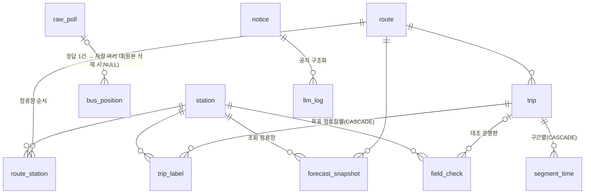

# DB 스키마 초안 (10/7 회의용)

**GBIS 원본(raw_poll) → 위치 기록(bus_position) → 운행편(trip) → 정답 라벨(trip_label)·구간 소요시간(segment_time) → 예보 스냅샷(forecast_snapshot)으로 흐르는 12개 테이블 초안이다. 기준 파일은 `backend/migrations/0001_init.sql`이고, 되돌리기는 `0001_down.sql`이다.**

> 아직 실제 DB에 실행해 보지 않은 초안이다. 회의에서 아래 '회의에서 정할 것'을 확정한 뒤 고쳐서 적용한다.

## 테이블

하루 행 수는 평일 수집 창(05:30~10:15) 기준이다. 표시가 없으면 추정이다.

| 테이블 | 무엇을 담나 | 누가 채우나 | 하루 행 수 |
|---|---|---|---|
| route | 노선(이름, 유형, 관할, 수집 여부, 라벨 대상, 예약·심야) | 사람(discover 결과 + settings) | 고정 18행(settings 목록) |
| station | 정류장(이름, 번호, 좌표) | 사람(discover) | 고정, 수백 행 |
| route_station | 노선별 정류장 순번, 회차 지점 | 사람(discover) | 고정, 수백~1천 행 |
| raw_poll | GBIS 응답 원본. JSONL 한 줄 = 한 행. **G1300·1306 위치와 덕현초교 도착만** | 수집기 | **2,850**(G1300 1,710 + 1306 570 + 도착 570, 설정값으로 계산) |
| bus_position | 위치 응답의 차량 1대 1회 관측 | 수집기(또는 JSONL 적재 스크립트) | 약 2만~4만(G1300 1,710회 × 10~20대 + 1306 570회 × 5~10대. 10/6 09:36 응답에 G1300 19대) |
| trip | 운행편(안정 키 `trip_key`, 날짜·노선·차량·하루 안 순번) | 라벨(F06) | 약 50~100(추정) |
| trip_label | 운행편 × 목표 정류장의 0석 정답, 등급, 미확인 사유 | 라벨(F06) | trip 수 × 규칙 버전 수 |
| segment_time | 구간 소요시간(덕현초교 → 하차 정류장 등) | 라벨(F06 뒤 단계) | trip 수 × 구간 수 |
| forecast_snapshot | 예보 1회의 확률·n·k·상태·대안, 근거 사례의 `trip_key` 목록 | 예보(F07) | 사용량에 따름. 요청 1회에 최대 약 18행(노선 2 × 후보 3 × 선행시간 3) |
| notice | 공지 링크, 구조화 결과, 승인 상태 | LLM + 사람(승인) | 0~몇 건 |
| llm_log | LLM 검사 결과·지연·고정 문구 대체 여부(질문은 HMAC만) | LLM(F08) | 300 이하(하루 상한) |
| field_check | 현장 대조 관측(만석 여부·잔여석, 관측자 코드, 메모 500자 이하) | 사람 | 조사일에 수십 건 |

용량 추정: raw_poll 본문이 압축 전 하루 약 10~20MB, bus_position이 인덱스 포함 약 5~10MB다. 평일 하루 15~30MB 정도라서 Supabase 무료 플랜(DB 500MB)이면 3~6주 안에 찬다. 추정치이므로 첫 적재 뒤 실측한다.

## 관계

- **원본과 위치 기록**: bus_position의 raw_poll FK는 NULL 허용이고 `ON DELETE SET NULL`이다. 보관 기간 정리는 raw_poll 행을 지우거나 `body`·`body_text`를 NULL로 비우는 방식으로 한다. 어느 쪽이든 위치 기록은 남는다.
- **위치 기록의 제약**: bus_position은 적재 실패로 행을 잃지 않게 필수 열을 `collected_at`, `route_id`(와 적재 순서)로 줄였다. route FK도 두지 않는다.
- **운행편을 다시 만들 때**: trip을 다시 만들면 trip_label·segment_time이 함께 지워진다(CASCADE). 예보 근거는 `forecast_snapshot.case_trip_keys`(trip_key 배열)와 `label_rule_version`으로 남으므로 추적이 끊기지 않는다. `trip_key`는 `날짜_routeId_vehId_순번` 형식이며 라벨 코드의 `Trip.trip_key`와 같다.
- **스냅샷 묶음**: 묶음 ID `snapshot_group_id`(uuid)를 API의 `snapshotId`로 그대로 쓴다. llm_log도 이 값으로 스냅샷 묶음을 가리킨다.
- **목적지**: `destination_id`는 API 명세 초안의 목적지 코드다(예: `jamsil`, `^[a-z_]{1,32}$`).
- **규칙 버전**: 라벨·구간 규칙이 바뀌면 `rule_version`을 바꿔 새 행을 넣고, 이전 행은 남긴다.

## 공통 규칙과 보안

- 시각은 `timestamptz`(KST로 계산). GBIS ID는 `text`.
- 상태·등급·사유 값은 enum 대신 `text` + `CHECK`로 둔다. 값이 바뀌면 CHECK만 고친다.
- GBIS 원값에는 NOT NULL·CHECK를 최소로 둔다(적재 실패로 기록을 잃지 않게).
- **RLS와 권한**: 모든 테이블에 RLS를 켜고 정책은 두지 않는다. 또한 `anon`·`authenticated`의 테이블·시퀀스 권한을 회수하고, 앞으로 만들 테이블·시퀀스·함수의 기본 권한도 회수한다. 정책 없는 RLS만으로는 TRUNCATE·뷰·SECURITY DEFINER를 막지 못하기 때문이다.
- **뷰와 함수**: 뷰는 반드시 `WITH (security_invoker = true)`로 만든다. SECURITY DEFINER 함수는 만들지 않는다.
- **raw_poll**: `params`에 `serviceKey`(대소문자 변형 포함)가 있으면 적재를 거부한다.
- **llm_log**: 질문 원문과 길이는 저장하지 않고 HMAC-SHA256(`query_hmac`)만 둔다. 키는 `backend/.env`의 별도 값(예: `QUERY_HMAC_KEY`)이며 DB·로그에 남기지 않는다. `error_code`는 고정 코드형(소문자·숫자·`_`, 64자 이하)이다.
- **field_check.memo**: 500자 이하이며 개인정보를 적지 않는다.

## 회의에서 정할 것

1. **선행시간 표시 방식**: 도착까지 7분 남았을 때 5분과 10분 중 어느 예보를 보여 줄지 정한다. 스냅샷에 3개를 모두 저장할지, 화면에 보여 준 1개만 저장할지도 함께 정한다.
2. **forecast_snapshot을 행 단위로 둘지, 묶음 단위로 둘지**: 초안은 행 단위다(`snapshot_group_id`로 묶음). 이 경우 조회 조건과 대안 결과가 행마다 중복된다. 묶음 테이블(`forecast_group`)을 두면 대안 결과·LLM 연결을 묶음 단위로 두고 FK도 걸 수 있다.
3. **raw_poll을 DB에도 둘지, JSONL에만 둘지**: 용량을 가장 많이 차지한다.
4. **보관 기간**: raw_poll 본문(행 삭제 또는 본문 비우기), bus_position, forecast_snapshot, llm_log를 각각 얼마나 둘지 정한다. JSONL 백업은 서버에 계속 둔다.
5. **라벨 등급 중 무엇을 정답으로 쓸지**: strict만 쓸지, strict와 relaxed를 함께 쓸지 정한다. 둘 다 저장하고, 사례·평가 쿼리에서 고른다.
6. **`not_validated`와 예비 표기의 관계**: 본선 전 확률을 '제공(ok) + 예비'로 둘지, '검증 미통과'로 둘지 정한다.
7. **segment_time의 구간 정의**: 덕현초교 → 하차 정류장 한 쌍만 둘지, 인접 정류장 구간을 모두 둘지 정한다.
8. **사례 특징 테이블**: 선행시간별 잔여석과 앞차 간격을 미리 계산해 둘지, 예보 때마다 bus_position에서 계산할지 정한다.
9. **접속 역할 분리**: API용 `api_reader`(읽기와 스냅샷·llm_log 쓰기)와 수집기용 `collector_writer`(raw_poll·bus_position 쓰기) 역할을 만들고, 역할별 GRANT와 RLS 정책을 둔다. 소유자 `postgres`로는 접속하지 않는다.
   - 주의: 소유자가 아닌 역할은 RLS를 적용받는다. 정책 없이 GRANT만 주면 모든 조회가 0행이 된다(오류 없이 빈 결과).

## Supabase 적용 전 확인

- **롤백 확인**: 시험 프로젝트에서 SQL Editor의 `BEGIN`/`COMMIT` 롤백 동작을 먼저 확인한다. 일부러 오류를 넣어 실행한 뒤 테이블이 하나도 남지 않는지 본다.
- **Data API 노출**: Data API(PostgREST) 기본 노출 설정(노출 스키마)을 확인한다. 필요 없으면 public 노출을 끈다.
- **service_role 키**: 백엔드 `.env`에 두지 않는다. 이 키는 RLS를 우회한다. 백엔드는 `DATABASE_URL` 직접 접속만 쓴다.
- **대상 스키마**: 이 파일은 Supabase 전용이다(`anon`·`authenticated` 역할이 있어야 REVOKE가 성공한다).

## 적용 방법

1. Supabase 대시보드 > SQL Editor에 `backend/migrations/0001_init.sql` 전체를 붙여 넣고 실행한다.
2. 파일 전체가 `BEGIN`/`COMMIT`으로 감싸져 있어서, 하나라도 실패하면 아무것도 만들어지지 않는다. 같은 이름의 테이블이 이미 있으면 실패한다.
3. 적용한 뒤 확인한다.
   - Table Editor에서 12개 테이블에 'RLS enabled'가 표시되는지 본다.
   - anon 키로 REST 조회를 했을 때 권한 오류나 빈 결과가 나오는지 본다.
4. 되돌릴 때는 대상 DB를 확인한 뒤 `backend/migrations/0001_down.sql`을 실행한다. 데이터도 모두 지워진다.
